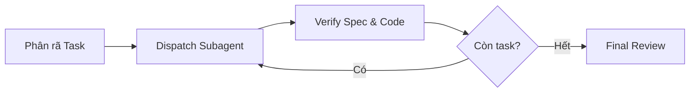

# Subagent Orchestrator SOP

> ⚡ **TỐI ƯU TOKEN (TOKEN EFFICIENCY)**:
> - Mỗi subagent nhận một prompt nhiệm vụ độc lập, ngữ cảnh tối thiểu cần thiết, KHÔNG kế thừa toàn bộ chat history (tránh context pollution).
> - Giữ bản ghi điều phối dạng bullet/ledger ngắn gọn. Tham khảo sâu tại `references/task-dispatch-guide.md`.

---

## 1. Nguyên Tắc Cốt Lõi (The Core Laws)

1. **Context Isolation**: Mỗi task giao cho 1 subagent mới. Subagent làm xong thì nén kết quả và đóng lại.
2. **Continuous Execution ("Rulings, not stalls")**: 
   - Đừng dừng lại hỏi vặt ("Em có nên tiếp tục không?"). Nếu gặp xung đột nhỏ hoặc plan thiếu chi tiết, hãy tự đưa ra phán quyết (Ruling), ghi chú lý do và tiếp tục chạy.
3. **Chỉ DỪNG khi gặp 4 điều kiện**:
   - Thao tác phá hủy/không thể hoàn tác (`rm -rf`, drop DB).
   - Hành động bảo mật nhạy cảm (deploy production, commit secret key).
   - Tác động ra ngoài workspace được quy định cần xác nhận.
   - Kế hoạch bị hỏng hoàn toàn, mọi hướng đi tiếp theo chỉ là phỏng đoán.

---

## 2. Quy Trình Điều Phối 4 Bước

1. **Task Decomposition**: Chia plan thành các task độc lập. Nếu 2 task không phụ thuộc file/state của nhau ➔ Dispatch song song (Parallel).
2. **Craft Task Brief**: Giao cho subagent:
   - Mục tiêu cụ thể + File cần sửa.
   - Lệnh kiểm chứng (Test command) bắt buộc.
3. **Task Review (Spec Compliance & Quality)**:
   - Kiểm tra `git diff` của subagent: Có chạm vào code ngoài scope không?
   - Chạy lệnh verify: Test có pass không?
4. **Close & Next**: Ghi nhận kết quả vào task ledger, dispatch task tiếp theo mà không làm gián đoạn người dùng.
